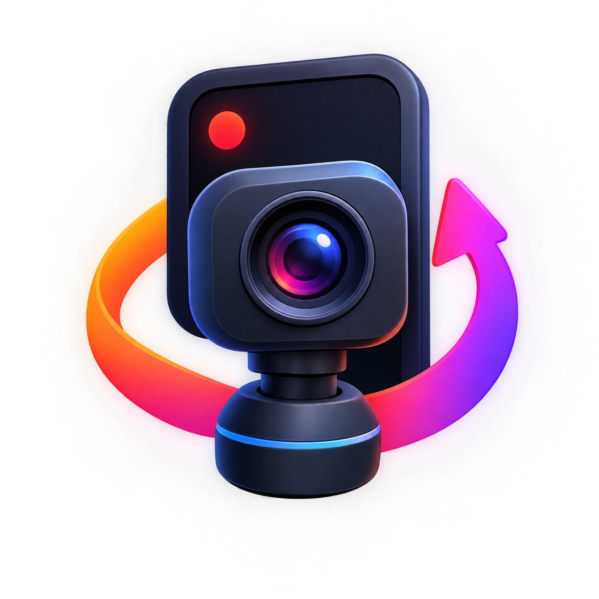
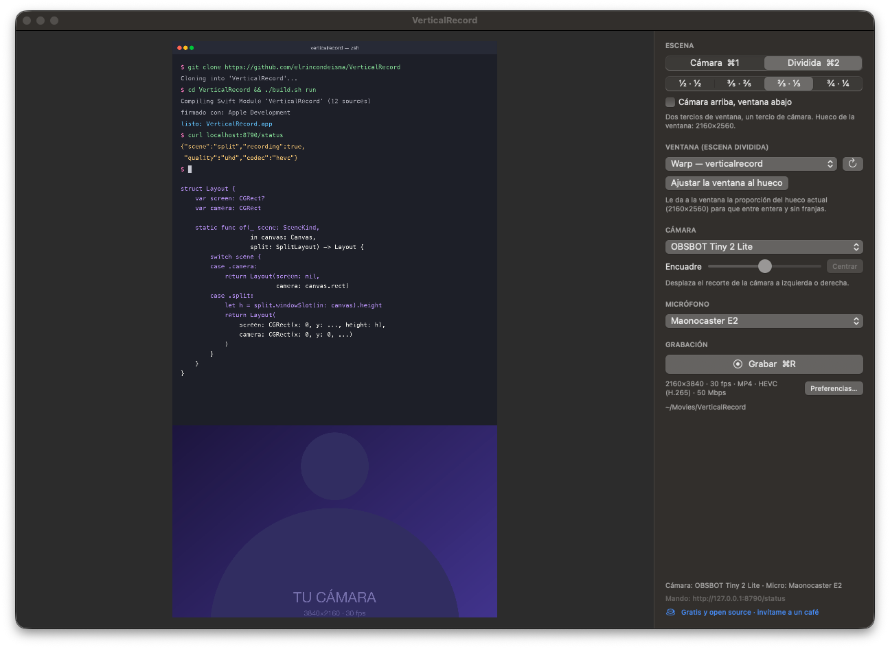
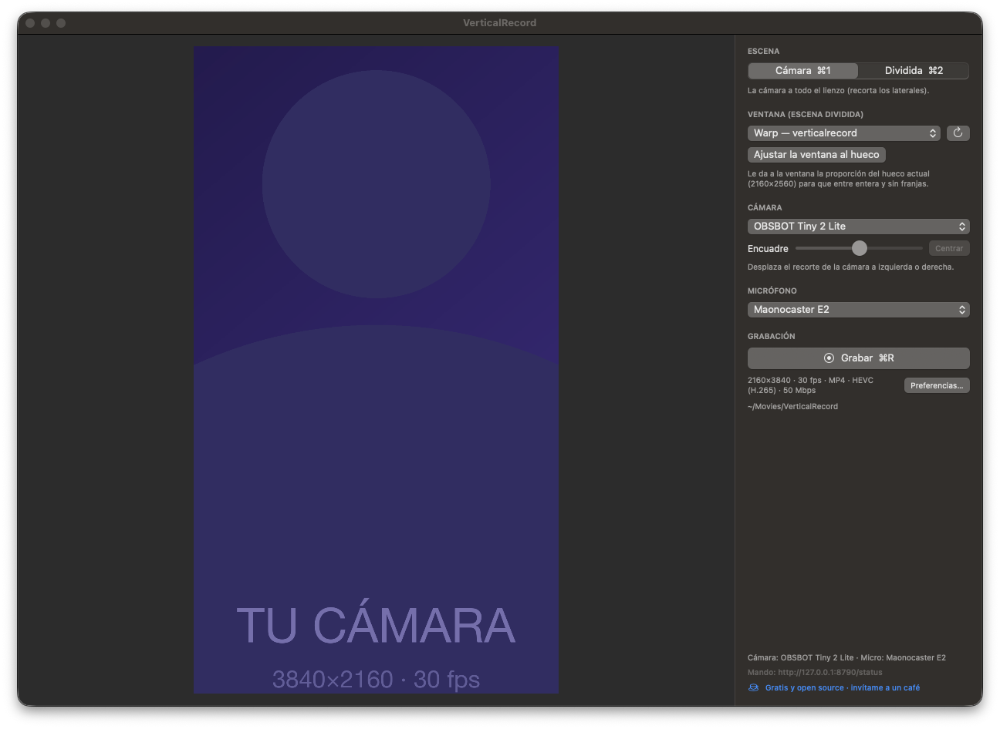
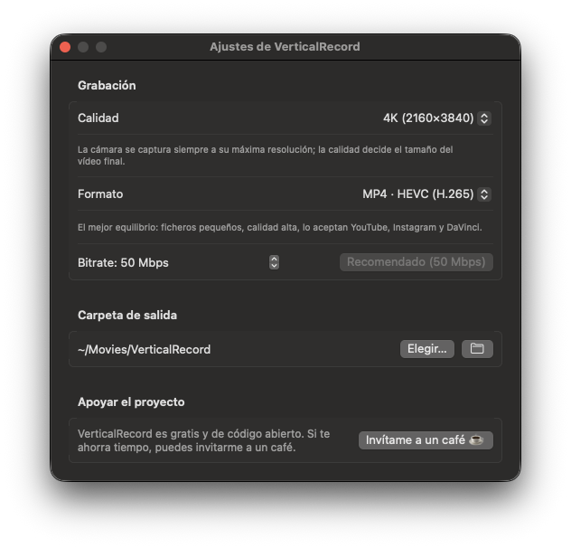

<p align="center">
  
</p>

<h1 align="center">VerticalRecord</h1>

<p align="center">
  Grabadora nativa de macOS para <strong>vídeo vertical</strong>: tu cámara, tu micro y una ventana, en 4K.<br>
  Dos escenas, un botón de grabar, y nada más.
</p>

<p align="center">
  <a href="https://github.com/elrincondeisma/VerticalRecord/releases/latest"></a>
  
  
  
  <a href="https://buymeacoffee.com/elrincondeisma"></a>
</p>

<p align="center">
  
</p>

> Hasta la versión 1.0 esta app se llamaba *MiniOBS*. «OBS» es una marca del OBS Project, así que
> cambió de nombre; los enlaces antiguos redirigen aquí y la app hereda tus preferencias y grabaciones.

OBS es enorme y está pensado para streaming horizontal. Para grabar Shorts, Reels y TikToks con
tu cara y tu pantalla solo hacen falta tres cosas: la cámara, el micro y la ventana en la que trabajas.
VerticalRecord hace eso, en vertical, a 4K, y ya está.

## Funciones

- **Lienzo vertical** 9:16, a **4K (2160×3840)** o 1080p, 30 fps.
- **Dos escenas**, cambiables en caliente mientras grabas:
  - **Cámara** — tu cámara a pantalla completa.
  - **Dividida** — la ventana que elijas y la cámara, con el reparto que quieras: ½·½, ⅗·⅖, ⅔·⅓ o ¾·¼,
    y la cámara arriba o abajo.
- **Captura de una ventana concreta**, no de una región de pantalla: la app que grabas puede estar
  en cualquier monitor y tapada por otras, y sigue saliendo entera (ScreenCaptureKit).
- **«Ajustar la ventana al hueco»**: redimensiona la ventana capturada a la proporción exacta del
  hueco para que entre sin franjas ni recortes. Con «Deshacer» para dejarla como estaba.
- **Encuadre de la cámara**: desplaza el recorte a izquierda o derecha si no estás en el centro.
- **HEVC, H.264 o ProRes 422**, codificación por hardware, audio AAC 48 kHz. Bitrate configurable.
- **Vista previa** del mismo fotograma que va al fichero: lo que ves es lo que se graba.
- **Atajos**: `⌘1` cámara, `⌘2` dividida, `⌘R` grabar/parar, `⌘,` preferencias.
- **Mando por HTTP** en `127.0.0.1:8790` para el Stream Deck, un script o lo que quieras.
- **Cierre seguro**: si sales grabando, el fichero se cierra bien antes de salir.
- Sin dependencias, sin cuentas, sin telemetría. ~1.700 líneas de Swift.

<p align="center">
  
  &nbsp;&nbsp;
  
</p>

## Instalación

1. Descarga el **DMG** de la [última versión](https://github.com/elrincondeisma/VerticalRecord/releases/latest).
2. Ábrelo y arrastra **VerticalRecord** a **Aplicaciones**.
3. La primera vez, macOS dirá que no puede verificar la app (no está notarizada con un certificado
   de pago de Apple). Ve a **Ajustes del Sistema → Privacidad y seguridad**, baja hasta el aviso y
   pulsa **«Abrir de todos modos»**. Solo hace falta una vez.

   Si prefieres la terminal:

   ```bash
   xattr -dr com.apple.quarantine /Applications/VerticalRecord.app
   ```

4. Al arrancar te pedirá permiso de **cámara**, **micrófono** y **grabación de pantalla**. El de
   **Accesibilidad** solo hace falta si usas «Ajustar la ventana al hueco».

Requiere macOS 15 (Sequoia) o posterior y un Mac con Apple Silicon.

## Uso

1. Elige la **ventana** que quieres grabar en la escena dividida (Warp, VS Code, el navegador…) y el
   **reparto** (cuánto lienzo se lleva la ventana). Si la ventana no tiene la proporción del hueco,
   pulsa **Ajustar la ventana al hueco**.
2. Elige **cámara** y **micrófono**. Si no sales centrado, mueve el **Encuadre**.
3. `⌘R` para grabar. Cambia de escena con `⌘1` / `⌘2` cuando quieras.
4. `⌘R` para parar. El vídeo está en `~/Movies/VerticalRecord/` (o la carpeta que elijas en Preferencias).

### Preferencias (`⌘,`)

| Ajuste | Opciones |
|---|---|
| Calidad | 1080p (1080×1920) · 4K (2160×3840) |
| Formato | MP4 · HEVC (recomendado) · MP4 · H.264 · MOV · ProRes 422 |
| Bitrate | 4–200 Mbps (no aplica a ProRes); botón «Recomendado» |
| Carpeta de salida | La que quieras |

La cámara se captura siempre a su máxima resolución; la calidad solo decide el tamaño del vídeo final.

## Mando a distancia (Stream Deck, scripts)

VerticalRecord escucha en `http://127.0.0.1:8790` (solo en tu máquina). Cada petición devuelve el estado
completo en JSON, así que una tecla que sondee `/status` puede encenderse sola.

```
GET /status
GET /scene/camera        GET /scene/split
GET /record/start        GET /record/stop        GET /record/toggle
GET /windows             GET /window/<id>        GET /window/<nombre de app>   (p. ej. /window/Warp)
GET /window/fit          GET /window/unfit
GET /split/half | threeFifths | twoThirds | threeQuarters      GET /split/top   GET /split/bottom
```

```bash
curl localhost:8790/record/toggle
# {"scene":"split","recording":true,"seconds":0,"quality":"uhd","codec":"hevc",...}
```

Con el plugin [API Request](https://github.com/mjbnz/sd-api-request)
del Stream Deck: URL de la acción, sondeo a `/status` cada pocos segundos y comparar `recording`
(o `scene`) para elegir la imagen de la tecla.

## Compilar desde el código

Solo hacen falta las Command Line Tools de Xcode (`xcode-select --install`).

```bash
git clone https://github.com/elrincondeisma/VerticalRecord
cd VerticalRecord
./build.sh run          # compila, monta VerticalRecord.app y lo abre
./release.sh 0.1.0      # además genera dist/VerticalRecord-0.1.0.dmg
```

`build.sh` firma con el certificado que encuentre (Developer ID → Apple Development → ad hoc).
Con Developer ID y un perfil de `notarytool` en `NOTARY_PROFILE`, `release.sh` notariza y grapa el DMG.

### Cómo está hecho

```
Sources/VerticalRecord/
  Scenes.swift          lienzo, calidades, códecs y layouts de las dos escenas
  CameraCapture.swift   AVCaptureSession: cámara (mejor formato a 30 fps) + micro, con recuperación de errores
  ScreenCapture.swift   ScreenCaptureKit: una ventana; detecta si cambia de tamaño y rearranca
  WindowFitter.swift    Accesibilidad: redimensiona la ventana capturada a la proporción del hueco
  Compositor.swift      Core Image sobre Metal: compone las fuentes en un búfer del pool
  Recorder.swift        AVAssetWriter: HEVC / H.264 / ProRes + AAC, reloj del host
  PreviewView.swift     AVSampleBufferDisplayLayer con el mismo búfer que va al fichero
  ControlServer.swift   mando HTTP en loopback
  Engine.swift          orquesta todo; temporizador a 30 fps en su propia cola
  ContentView.swift     ventana principal
  PreferencesView.swift preferencias
```

La composición no la marcan las cámaras: un temporizador a 30 fps coge el último fotograma de cada
fuente y renderiza. Si una fuente se atasca, el vídeo sigue saliendo estable. El tiempo de cada
fotograma es el reloj del host, el mismo que usa AVCaptureSession para el audio, así que no hay
desincronía que corregir.

## Límites conocidos

- La escena «Cámara» amplía la imagen si tu cámara es apaisada (una 4K horizontal se escala ×1,78
  para llenar el lienzo vertical). En la escena dividida la cámara va casi a tamaño nativo.
- Si la ventana capturada se cierra, la parte de arriba se queda en negro hasta elegir otra (↻).
- Una sola cámara, un solo micro, dos escenas. Es la idea.

## Apoyar el proyecto

VerticalRecord es gratis y de código abierto, y lo va a seguir siendo. Si te ahorra tiempo,
puedes [invitarme a un café](https://buymeacoffee.com/elrincondeisma) ☕ — también hay un botón
«Sponsor» arriba del repo. Y si haces vídeos con ella, cuéntamelo en
[El Rincón de Isma](https://www.youtube.com/@elrincondeisma).

## Licencia

[MIT](LICENSE). Hecho por [Ismael Catalá](https://www.youtube.com/@elrincondeisma) para grabar
los Shorts de *El Rincón de Isma*.
